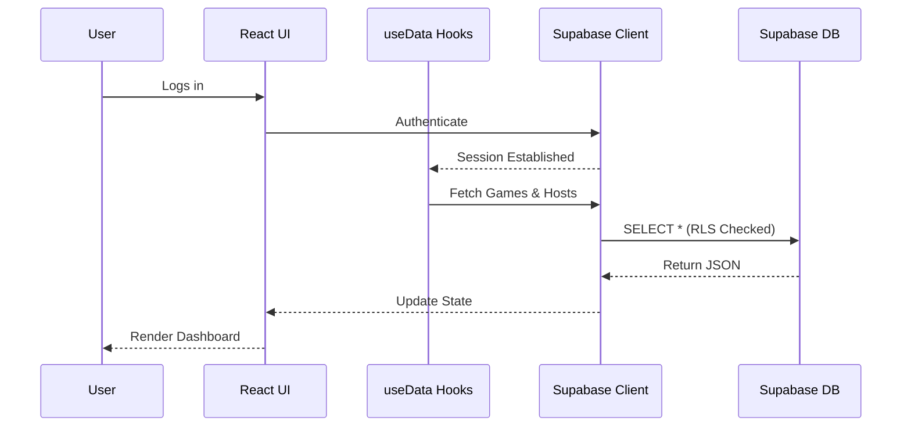
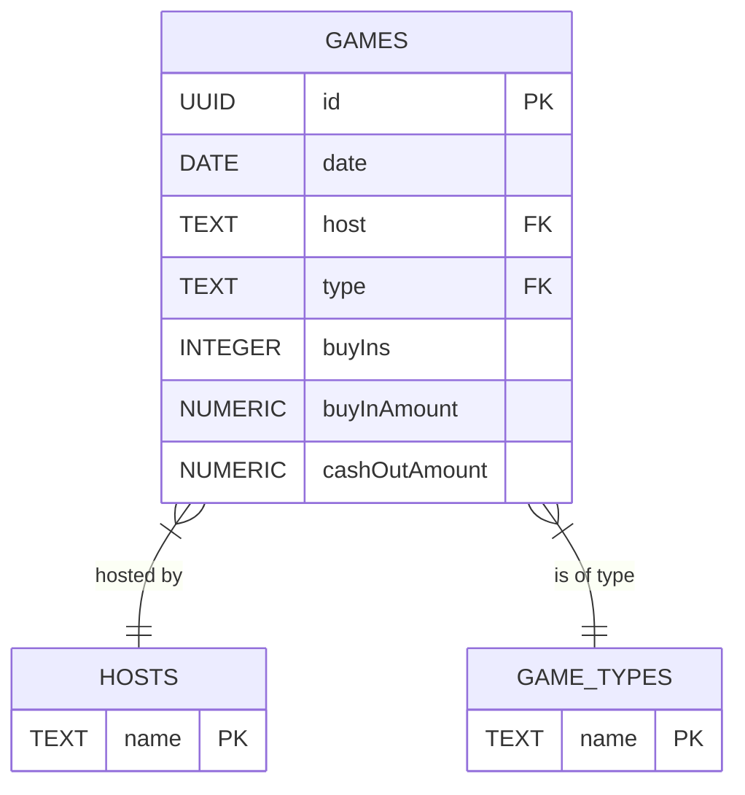
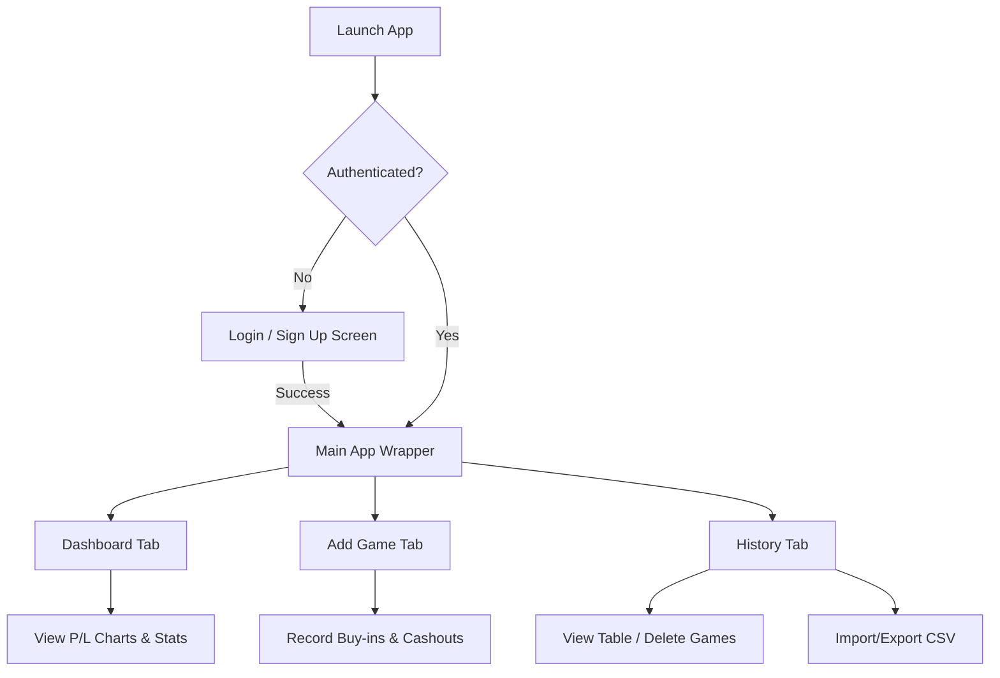

# ♠️ Poker Tracker

A secure, cloud-synced, mobile-first web application designed to track your live poker sessions, calculate profit/loss, and visualize your performance over time.

## 🏗 Architecture & Logic

Poker Tracker is built using a modern **Backend-as-a-Service (BaaS)** architecture. This allows the application to be completely serverless, meaning the frontend can be hosted for free on static providers like Netlify or Vercel, while the database is securely managed in the cloud.

* **Frontend**: React (built with Vite)
* **Styling**: Custom responsive CSS with a sleek, premium dark-mode aesthetic.
* **Backend**: Supabase (PostgreSQL database, GoTrue Authentication, PostgREST API)
* **Data Visualization**: Recharts

### 🔄 Data Flow

The application relies on custom React hooks to manage real-time synchronization with the Supabase backend. When a user logs in, the hooks automatically subscribe to their session and fetch the latest data securely.



### 📊 Database Schema

The database uses a simple relational model, with `games` serving as the central fact table.



### 📱 UI Flow

The application is split into three main tabs for ease of use on mobile devices, gated by a secure authentication layer.



---

## 🚀 Setup Guide

If you are cloning this repository to run your own instance of Poker Tracker, follow these exact steps to set up your secure database and connect your frontend.

### 1. Local Setup
Clone the repository and install the dependencies:
```bash
git clone <your-repo-url>
cd poker-tracker
npm install
```

### 2. Create a Supabase Project
1. Create a free account at [Supabase.com](https://supabase.com).
2. Create a new Project.
3. Once your project is ready, navigate to **Project Settings > API**.
4. Keep your **Project URL** and **anon public** API key handy.

### 3. Connect the App
Create a `.env` file in the root of your local project and paste your keys:
```env
VITE_SUPABASE_URL=your_project_url_here
VITE_SUPABASE_ANON_KEY=your_anon_key_here
```

### 4. Create the Database Tables
Navigate to the **SQL Editor** in your Supabase Dashboard on the left sidebar, paste the following code, and hit **Run**:

```sql
-- Create hosts table
CREATE TABLE hosts (
  name TEXT PRIMARY KEY
);

-- Create game_types table
CREATE TABLE game_types (
  name TEXT PRIMARY KEY
);

-- Insert default types
INSERT INTO game_types (name) VALUES ('cash'), ('tournament'), ('mixed');

-- Create games table
CREATE TABLE games (
  id UUID DEFAULT gen_random_uuid() PRIMARY KEY,
  date DATE NOT NULL,
  host TEXT REFERENCES hosts(name) NOT NULL,
  type TEXT REFERENCES game_types(name) DEFAULT 'cash',
  "buyIns" INTEGER NOT NULL,
  "buyInAmount" NUMERIC NOT NULL,
  "cashOutAmount" NUMERIC NOT NULL
);
```

### 5. Secure the Database (Row Level Security)
By default, the database is vulnerable. We must tell Supabase to reject any read or write requests from anyone who isn't explicitly logged into the app.

In the same **SQL Editor**, run this snippet to lock down the tables:
```sql
ALTER TABLE games ENABLE ROW LEVEL SECURITY;
ALTER TABLE hosts ENABLE ROW LEVEL SECURITY;
ALTER TABLE game_types ENABLE ROW LEVEL SECURITY;

CREATE POLICY "Only authenticated users can access games" ON games FOR ALL USING (auth.role() = 'authenticated');
CREATE POLICY "Only authenticated users can access hosts" ON hosts FOR ALL USING (auth.role() = 'authenticated');
CREATE POLICY "Only authenticated users can access game_types" ON game_types FOR ALL USING (auth.role() = 'authenticated');

-- Flush schema cache to ensure immediate enforcement
NOTIFY pgrst, 'reload schema';
```

### 6. Create Your Account & Lock Signups
Now that the database is secure, you need to create your personal account and prevent anyone else from making one.
1. Start your local React server:
```bash
npm run dev
```
2. Open the app in your browser (`http://localhost:5173`), click **Sign Up**, and create your account.
3. Once logged in, go back to your **Supabase Dashboard**.
4. Navigate to **Authentication > Providers > Email** (or Project Settings > Authentication depending on your dashboard version).
5. Toggle **Enable Email Signup** to **OFF** and hit **Save**.

*Congratulations! Your app is now completely secure. Only you can log in, and only logged-in users can view or edit the database.*

## License
This project is licensed under the MIT License - see the [LICENSE.md](LICENSE.md) file for details. All rights reserved Traveling Tech Guy LLC.
